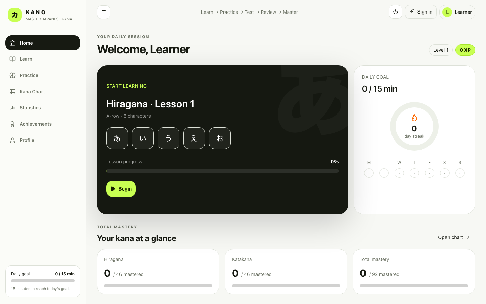

# KANO

> Master Japanese Hiragana and Katakana through smart adaptive practice.

KANO is a modern Japanese kana learning platform designed to make memorizing Hiragana and Katakana faster through adaptive repetition, statistics, and interactive exercises.



## Features

- Complete 46-character Hiragana and 46-character Katakana sets
- Progressive lessons with Learn → Practice → Test flow
- Nine interactive practice modes, immediate feedback, and keyboard controls
- Weighted adaptive practice based on mastery, errors, recency, and speed
- Searchable mastery map, statistics, XP, streaks, goals, and achievements
- Guest mode with persistent local progress and optional Supabase auth
- Responsive light and dark interfaces

## Tech stack

Next.js, React, TypeScript, Tailwind CSS, Framer Motion, Zustand, Recharts, Supabase, PostgreSQL, and Lucide Icons.

## Getting started

```bash
pnpm install
pnpm dev
```

## Environment variables

Copy `.env.example` to `.env.local` and add your Supabase project values. Without them, KANO runs fully in guest mode.

```env
NEXT_PUBLIC_SUPABASE_URL=https://your-project.supabase.co
NEXT_PUBLIC_SUPABASE_ANON_KEY=your-anon-key
```

## Database setup

1. Create a Supabase project.
2. Run `supabase/schema.sql` in the SQL editor.
3. Enable Google authentication and add callback URLs.
4. Seed the `kana` table from `data/kana.ts` when enabling cloud sync.

## Project structure

```text
app/                 Application shell, screens, and theme
components/ui/       Accessible reusable UI primitives
data/                Complete kana seed data and lesson groups
services/            Supabase client and auth helpers
stores/              Persistent Zustand learning state
supabase/             PostgreSQL schema and RLS policies
public/               Brand assets and screenshots
```

## Adaptive learning

Every answer updates a 0–100 mastery score. Correct, fast answers raise mastery; errors reduce it. Weighted selection gives weaker kana more exposure while excluding the immediately previous character to avoid repetitive loops.

## Roadmap

- Cloud progress synchronization
- Dakuten, handakuten, and yōon modules
- Vocabulary and JLPT N5 tracks
- Recorded native-speaker audio
- Installable mobile app experience

## License

MIT — see [LICENSE](LICENSE).
